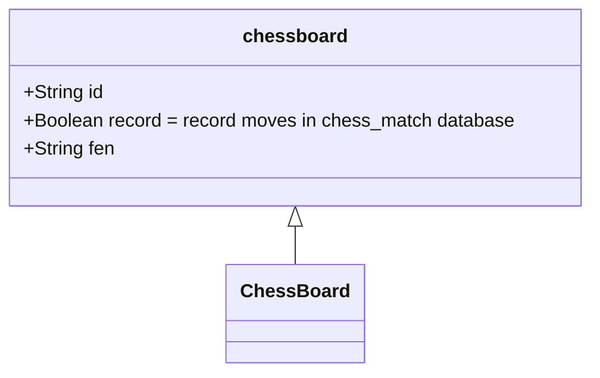

# schaakzet.github.io

Roads Technology SchaakZet project

Repo: https://github.com/schaakzet/schaakzet.github.io

###

* HTML & CSS design : https://jsfiddle.net/RvdSf/fx1bvqgm/
* Create long CSS with JavaScipt : https://jsfiddle.net/RvdSf/kz97ao0t/
* Position pieces in start position with FEN notation

### To do vanaf maandag 15-11-2021:
1. TurnWhite, TurnBlack met boolean.
2. Schaakmat. End of game. Wit of zwart gewonnen bericht. 
3. Roqueren mogelijke zetten. 
4. En passant mogelijke zetten. 
5. Alle mogelijke zetten. potentialMoves. 
6. Is move potentialMoves, move(). 
7. Move history. e5e4, e4e3, etc. In database. 
8. Move back. 
9. Enter FEN-position.

### Programmeren door Sandro

* Code woensdag 3 november. Gekopieerd naar v04.js!!! \* set fen() {code}

* Code maandag 8 november. Gekopieerd naar v05.js!!!
* get fen() {code} en chessboard.clear();

* Code woensdag 10 november. Defined <chess-square> in v06.js. Added ClickHandlers.

* Code maandag 15 november. Enter FEN index.html. Put userFEN on board.

* Code woensdag 17 november. potentialMoves voor paard en andere stukken. v07.js!!!

* Code maandag 22 november. potentialMoves in switch statement voor alle stukken. v07.js!!!

* Code woensdag 24 november + maandag 29 november. potentialMoves beperken tot je tegen een stuk aanloopt of vijandig stuk slaan. Pion moves verwerken. v08.js!!!

# Web Components

## ``<chess-board>``

