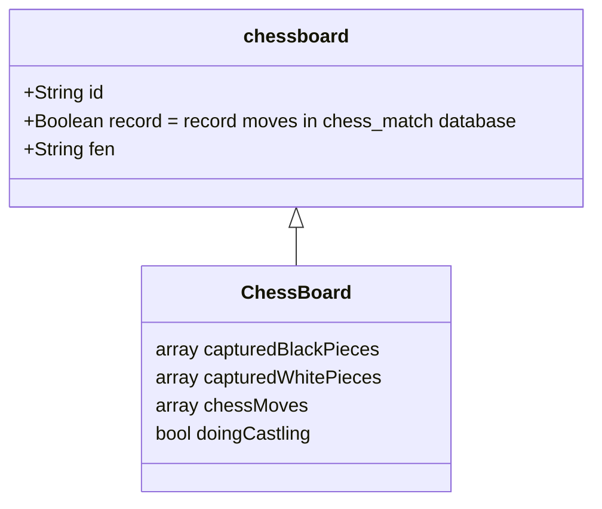

# schaakzet.github.io

Roads Technology SchaakZet project

---
### Repository
[schaakzet.github.io](https://github.com/schaakzet/schaakzet.github.io)

---

### Documentation
- [Forsyth–Edwards Notation (FEN)](https://en.wikipedia.org/wiki/Forsyth%E2%80%93Edwards_Notation)
- [Mermaid Diagrams](https://mermaid-js.github.io)

---

### Data Store

```mermaid
erDiagram
      MATCH ||--o{ MATCHMOVE : one-to-many
      MATCH {
            string id
      }
      MATCHMOVE {
            int id
            string match_id
            string move
            string fen
      }
```

---
### Web Components

#### ``<chess-board>``

